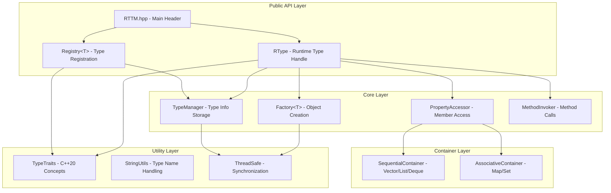
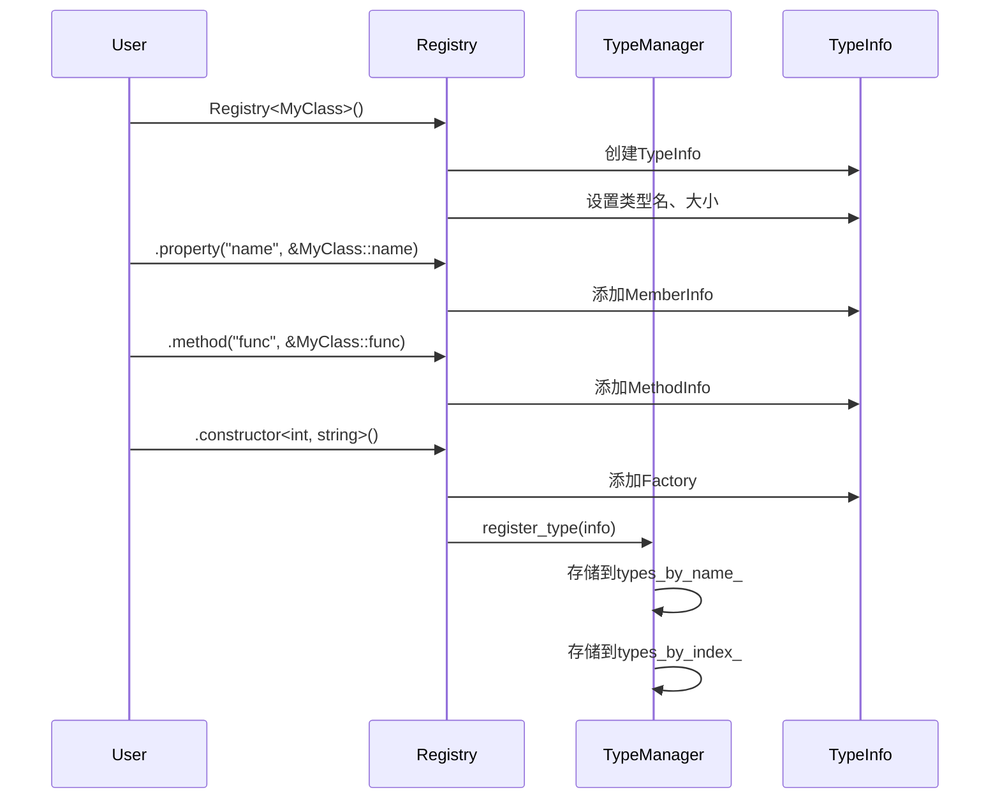
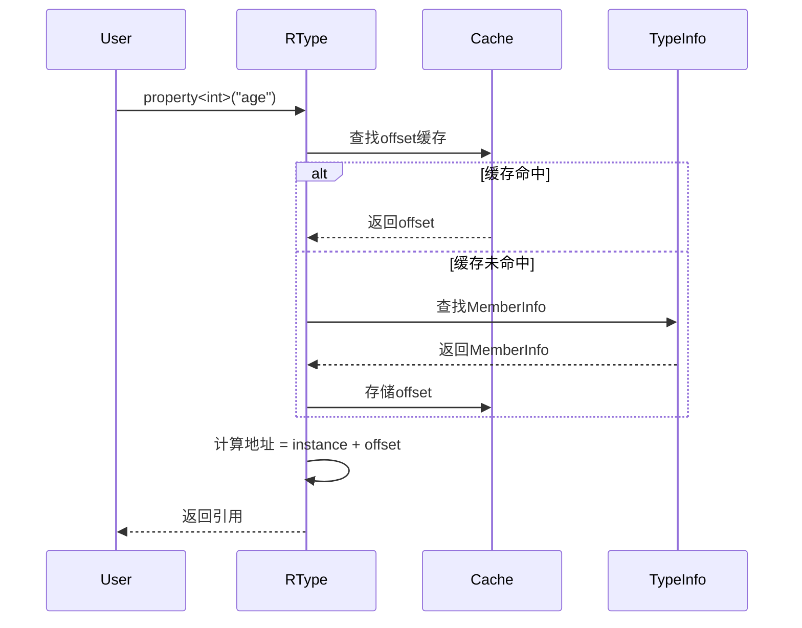

# Design Document: RTTM Refactor

## Overview

本设计文档描述RTTM (Runtime Turbo Mirror) C++20动态反射库的重构方案。重构目标是创建一个易用、高性能、可扩展的现代C++反射库，全面采用C++20特性，移除ECS功能，专注于核心反射能力。

### 设计原则

1. **简洁优先**: API设计追求最小化，避免过度抽象
2. **零开销抽象**: 使用C++20特性实现编译时优化
3. **类型安全**: 通过concepts约束模板参数
4. **线程安全**: 默认支持多线程环境
5. **可组合性**: 各组件可独立使用

## Architecture

### 整体架构图



### 模块划分

| 模块 | 文件 | 职责 |
|------|------|------|
| Core | RTTM.hpp | 主入口，包含所有公共API |
| TypeTraits | detail/TypeTraits.hpp | C++20 concepts和类型萃取 |
| TypeManager | detail/TypeManager.hpp | 类型信息存储和查询 |
| Factory | detail/Factory.hpp | 对象创建和内存管理 |
| Property | detail/Property.hpp | 属性访问和缓存 |
| Method | detail/Method.hpp | 方法包装和调用 |
| Container | detail/Container.hpp | 容器抽象接口 |

## Components and Interfaces

### 1. C++20 Concepts 定义

```cpp
namespace rttm {

// 可反射类型概念
template<typename T>
concept Reflectable = std::is_class_v<T> && !std::is_abstract_v<T>;

// 可默认构造概念
template<typename T>
concept DefaultConstructible = std::is_default_constructible_v<T>;

// 顺序容器概念
template<typename T>
concept SequentialContainer = requires(T t) {
    typename T::value_type;
    typename T::iterator;
    { t.size() } -> std::convertible_to<std::size_t>;
    { t.begin() } -> std::same_as<typename T::iterator>;
    { t.end() } -> std::same_as<typename T::iterator>;
    { t.push_back(std::declval<typename T::value_type>()) };
};

// 关联容器概念
template<typename T>
concept AssociativeContainer = requires(T t) {
    typename T::key_type;
    typename T::iterator;
    { t.size() } -> std::convertible_to<std::size_t>;
    { t.find(std::declval<typename T::key_type>()) } -> std::same_as<typename T::iterator>;
    { t.contains(std::declval<typename T::key_type>()) } -> std::convertible_to<bool>;
};

// 可调用成员函数概念
template<typename F, typename R, typename... Args>
concept MemberFunction = std::is_member_function_pointer_v<F>;

} // namespace rttm
```

### 2. TypeInfo 数据结构

```cpp
namespace rttm::detail {

// 成员信息
struct MemberInfo {
    std::string_view name;
    std::size_t offset;
    std::type_index type_index;
    enum class Category { Primitive, Class, Enum, Sequential, Associative } category;
};

// 方法信息
struct MethodInfo {
    std::string_view name;
    std::function<std::any(void*, std::span<std::any>)> invoker;
    std::vector<std::type_index> param_types;
    std::type_index return_type;
    bool is_const;
};

// 类型信息
struct TypeInfo {
    std::string_view name;
    std::size_t size;
    std::type_index type_index;
    
    std::unordered_map<std::string_view, MemberInfo> members;
    std::unordered_map<std::string_view, std::vector<MethodInfo>> methods;
    std::unordered_map<std::string, std::function<std::shared_ptr<void>()>> factories;
    
    std::function<void(void*)> destructor;
    std::function<void(void*, const void*)> copier;
    
    std::vector<std::type_index> base_types;
};

} // namespace rttm::detail
```

### 3. TypeManager 单例

```cpp
namespace rttm::detail {

class TypeManager {
public:
    static TypeManager& instance() {
        static TypeManager mgr;
        return mgr;
    }
    
    // 注册类型
    void register_type(std::string_view name, TypeInfo info);
    
    // 查询类型（线程安全）
    const TypeInfo* get_type(std::string_view name) const;
    const TypeInfo* get_type(std::type_index index) const;
    
    // 检查是否已注册
    bool is_registered(std::string_view name) const;
    
private:
    mutable std::shared_mutex mutex_;
    std::unordered_map<std::string_view, TypeInfo> types_by_name_;
    std::unordered_map<std::type_index, TypeInfo*> types_by_index_;
    
    // 线程本地缓存
    static thread_local std::unordered_map<std::string_view, const TypeInfo*> tls_cache_;
};

} // namespace rttm::detail
```

### 4. Registry<T> 类型注册器

```cpp
namespace rttm {

template<Reflectable T>
class Registry {
public:
    Registry();
    
    // 链式API
    template<typename U>
    Registry& property(std::string_view name, U T::* member);
    
    template<typename R, typename... Args>
    Registry& method(std::string_view name, R(T::*func)(Args...));
    
    template<typename R, typename... Args>
    Registry& method(std::string_view name, R(T::*func)(Args...) const);
    
    template<typename... Args>
    Registry& constructor();
    
    template<typename Base>
    Registry& base();
    
private:
    detail::TypeInfo info_;
};

} // namespace rttm
```

### 5. RType 运行时类型句柄

```cpp
namespace rttm {

class RType {
public:
    // 获取类型
    static std::shared_ptr<RType> get(std::string_view type_name);
    
    template<typename T>
    static std::shared_ptr<RType> get();
    
    // 创建实例
    template<typename... Args>
    bool create(Args&&... args);
    
    // 附加已有实例
    template<typename T>
    void attach(T& instance);
    
    // 属性访问
    template<typename T>
    T& property(std::string_view name);
    
    std::shared_ptr<RType> property(std::string_view name);
    
    // 方法调用
    template<typename R, typename... Args>
    R invoke(std::string_view name, Args&&... args);
    
    // 类型信息
    std::string_view type_name() const;
    bool is_valid() const;
    bool is_class() const;
    bool is_enum() const;
    
    // 属性遍历
    std::vector<std::string_view> property_names() const;
    std::vector<std::string_view> method_names() const;
    
    // 原始指针访问（性能关键路径）
    void* raw() const;
    
    template<typename T>
    T& as();
    
private:
    const detail::TypeInfo* info_;
    std::shared_ptr<void> instance_;
    bool created_ = false;
    
    // 属性偏移缓存
    mutable std::unordered_map<std::string_view, std::size_t> offset_cache_;
};

} // namespace rttm
```

### 6. 容器抽象接口

```cpp
namespace rttm {

// 顺序容器接口
class ISequentialContainer {
public:
    virtual ~ISequentialContainer() = default;
    
    virtual std::size_t size() const = 0;
    virtual bool empty() const = 0;
    virtual void clear() = 0;
    
    virtual std::shared_ptr<RType> at(std::size_t index) = 0;
    virtual void push_back(const std::shared_ptr<RType>& value) = 0;
    virtual void pop_back() = 0;
    
    // 迭代器支持
    class Iterator {
    public:
        virtual ~Iterator() = default;
        virtual std::shared_ptr<RType> current() = 0;
        virtual bool next() = 0;
        virtual void reset() = 0;
    };
    
    virtual std::unique_ptr<Iterator> begin() = 0;
};

// 关联容器接口
class IAssociativeContainer {
public:
    virtual ~IAssociativeContainer() = default;
    
    virtual std::size_t size() const = 0;
    virtual bool empty() const = 0;
    virtual void clear() = 0;
    
    virtual std::shared_ptr<RType> find(const std::shared_ptr<RType>& key) = 0;
    virtual bool contains(const std::shared_ptr<RType>& key) = 0;
    virtual void insert(const std::shared_ptr<RType>& key, const std::shared_ptr<RType>& value) = 0;
    virtual bool erase(const std::shared_ptr<RType>& key) = 0;
    
    // 键值迭代器
    class KeyValueIterator {
    public:
        virtual ~KeyValueIterator() = default;
        virtual std::shared_ptr<RType> key() = 0;
        virtual std::shared_ptr<RType> value() = 0;
        virtual bool next() = 0;
        virtual void reset() = 0;
    };
    
    virtual std::unique_ptr<KeyValueIterator> begin() = 0;
};

} // namespace rttm
```

### 7. Factory 对象工厂

```cpp
namespace rttm::detail {

template<typename T>
class Factory {
public:
    template<typename... Args>
    static std::shared_ptr<void> create(Args&&... args) {
        return std::make_shared<T>(std::forward<Args>(args)...);
    }
    
    // 池化分配（可选优化）
    template<typename... Args>
    static std::shared_ptr<void> create_pooled(Args&&... args);
};

} // namespace rttm::detail
```

## Data Models

### 类型注册流程



### 属性访问流程




## Error Handling

### 异常层次结构

```cpp
namespace rttm {

// 基础异常
class ReflectionError : public std::runtime_error {
public:
    using std::runtime_error::runtime_error;
};

// 类型未注册
class TypeNotRegisteredError : public ReflectionError {
public:
    explicit TypeNotRegisteredError(std::string_view type_name)
        : ReflectionError(std::format("Type '{}' is not registered", type_name))
        , type_name_(type_name) {}
    
    std::string_view type_name() const { return type_name_; }
private:
    std::string type_name_;
};

// 属性未找到
class PropertyNotFoundError : public ReflectionError {
public:
    PropertyNotFoundError(std::string_view type_name, std::string_view prop_name,
                          std::span<std::string_view> available)
        : ReflectionError(format_message(type_name, prop_name, available))
        , type_name_(type_name), property_name_(prop_name) {}
    
private:
    static std::string format_message(std::string_view type, std::string_view prop,
                                      std::span<std::string_view> available);
    std::string type_name_;
    std::string property_name_;
};

// 方法签名不匹配
class MethodSignatureMismatchError : public ReflectionError {
public:
    MethodSignatureMismatchError(std::string_view method_name,
                                  std::string_view expected,
                                  std::string_view actual)
        : ReflectionError(std::format(
            "Method '{}' signature mismatch: expected '{}', got '{}'",
            method_name, expected, actual)) {}
};

// 对象未创建
class ObjectNotCreatedError : public ReflectionError {
public:
    explicit ObjectNotCreatedError(std::string_view type_name)
        : ReflectionError(std::format(
            "Object of type '{}' has not been created", type_name)) {}
};

} // namespace rttm
```

### 错误处理策略

1. **类型未注册**: 抛出 `TypeNotRegisteredError`，包含类型名
2. **属性未找到**: 抛出 `PropertyNotFoundError`，包含可用属性列表
3. **方法签名不匹配**: 抛出 `MethodSignatureMismatchError`，包含期望和实际签名
4. **对象未创建**: 抛出 `ObjectNotCreatedError`
5. **创建失败**: 清理部分状态，抛出原始异常

## Testing Strategy

### 测试框架

使用 Google Test + 属性测试库（如 RapidCheck）进行测试。

### 测试分类

1. **单元测试**: 测试各组件的独立功能
2. **属性测试**: 验证通用正确性属性
3. **集成测试**: 测试组件间交互
4. **性能测试**: 验证性能要求

### 测试配置

- 属性测试最少运行100次迭代
- 每个属性测试标注对应的设计属性编号
- 标签格式: `Feature: rttm-refactor, Property N: <property_text>`


## Correctness Properties

*A property is a characteristic or behavior that should hold true across all valid executions of a system—essentially, a formal statement about what the system should do. Properties serve as the bridge between human-readable specifications and machine-verifiable correctness guarantees.*

### Property 1: Registration Chain Completeness

*For any* type T with N properties and M methods, registering them using chained calls `Registry<T>().property(...).property(...).method(...)` SHALL result in all N properties and M methods being accessible through RType.

**Validates: Requirements 2.1**

### Property 2: Auto Default Constructor Registration

*For any* type T that is default constructible, after `Registry<T>()` is called without explicit constructor registration, `RType::get<T>()->create()` SHALL succeed and create a valid instance.

**Validates: Requirements 2.2**

### Property 3: Type-Safe Property Access

*For any* registered type T with property P of type U, `rtype->property<U>("P")` SHALL return a reference to the correct value, and `rtype->property<V>("P")` where V != U SHALL throw a type mismatch exception.

**Validates: Requirements 2.3**

### Property 4: Non-Existent Property Exception

*For any* registered type T and property name N that does not exist in T, `rtype->property(N)` SHALL throw `PropertyNotFoundError` containing the property name N.

**Validates: Requirements 2.4**

### Property 5: RType Shared Pointer Return

*For any* registered type name, `RType::get(type_name)` SHALL return a non-null `std::shared_ptr<RType>`.

**Validates: Requirements 3.2**

### Property 6: Duplicate Registration Idempotence

*For any* type T, calling `Registry<T>()` multiple times SHALL NOT throw an exception, and subsequent calls SHALL NOT modify the existing type information.

**Validates: Requirements 5.2**

### Property 7: Type Info Caching Consistency

*For any* type T, multiple calls to `RType::get<T>()` SHALL return RType instances that reference the same underlying TypeInfo (pointer equality for type info).

**Validates: Requirements 5.3**

### Property 8: Thread-Safe Type Operations

*For any* set of concurrent operations (registrations and lookups) on the TypeManager, the system SHALL NOT exhibit data races, and all lookups SHALL return consistent results.

**Validates: Requirements 5.4, 12.1, 12.2, 12.3**

### Property 9: Template and Dynamic Property Equivalence

*For any* registered type T with property P of type U, `rtype->property<U>("P")` and `rtype->property("P")->as<U>()` SHALL return equivalent values.

**Validates: Requirements 6.3**

### Property 10: Argument Type Auto-Conversion

*For any* method M that takes `std::string` parameter, invoking M with `const char*` argument SHALL succeed and pass the converted string value.

**Validates: Requirements 7.1**

### Property 11: Method Signature Error Message

*For any* method M called with incorrect argument types, the thrown exception SHALL contain the method name and both expected and actual type signatures.

**Validates: Requirements 7.2**

### Property 12: Const and Non-Const Method Support

*For any* class with both const method `T::foo() const` and non-const method `T::bar()`, both methods SHALL be invocable through RType on appropriate instances.

**Validates: Requirements 7.3**

### Property 13: Void Return Type Support

*For any* method M with void return type, `rtype->invoke<void>("M", args...)` SHALL execute the method without throwing type-related exceptions.

**Validates: Requirements 7.5**

### Property 14: Sequential Container Operations

*For any* sequential container (vector, list, deque) property, the ISequentialContainer interface SHALL correctly implement size(), at(), push_back(), pop_back() operations that modify the underlying container.

**Validates: Requirements 8.2**

### Property 15: Associative Container Operations

*For any* associative container (map, unordered_map, set, unordered_set) property, the IAssociativeContainer interface SHALL correctly implement size(), find(), insert(), erase(), contains() operations.

**Validates: Requirements 8.3**

### Property 16: Container Category Detection

*For any* container property, the system SHALL correctly categorize std::vector/list/deque as Sequential and std::map/unordered_map/set/unordered_set as Associative.

**Validates: Requirements 8.4, 8.5, 8.6**

### Property 17: Unregistered Type Exception

*For any* type name that has not been registered, `RType::get(type_name)` SHALL throw `TypeNotRegisteredError` containing the type name.

**Validates: Requirements 9.1**

### Property 18: Property Not Found Exception Details

*For any* registered type T with properties {P1, P2, ...} and non-existent property name N, the thrown `PropertyNotFoundError` SHALL include the list of available property names.

**Validates: Requirements 9.2**

### Property 19: Method Call Failure Exception Details

*For any* failed method invocation, the thrown exception SHALL contain the method name, expected parameter types, and actual argument types provided.

**Validates: Requirements 9.3**

### Property 20: Creation Failure Cleanup

*For any* object creation that fails (e.g., constructor throws), the RType instance SHALL remain in an invalid state with no partial object allocated.

**Validates: Requirements 9.5**

### Property 21: Inheritance Property Access

*For any* derived class D registered with `base<B>()`, all properties and methods of B SHALL be accessible through `RType::get<D>()` with correct values.

**Validates: Requirements 10.1, 10.2, 10.4**

### Property 22: Multi-Level Inheritance

*For any* class hierarchy A → B → C where C is registered with `base<B>()` and B with `base<A>()`, properties and methods from both A and B SHALL be accessible through `RType::get<C>()`.

**Validates: Requirements 10.3**

### Property 23: Property Enumeration Completeness

*For any* registered type T with N properties, `rtype->property_names()` SHALL return exactly N property names, and iterating over them SHALL visit each property exactly once.

**Validates: Requirements 11.1, 11.2**

### Property 24: Property Category Information

*For any* property P, the PropertyInfo SHALL correctly identify its category as one of: Primitive, Class, Enum, Sequential, or Associative based on the actual type.

**Validates: Requirements 11.3, 11.5**
